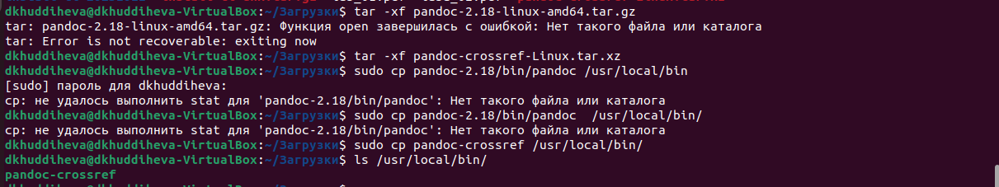

---
## Front matter
title: "Отчёт по лабораторной работе №3"
subtitle: "Дисциплина: архитектура компьютера"
author: "Худдыева Дженнет"

## Generic otions
lang: ru-RU
toc-title: "Содержание"

## Bibliography
bibliography: bib/cite.bib
csl: pandoc/csl/gost-r-7-0-5-2008-numeric.csl

## Pdf output format
toc: true # Table of contents
toc-depth: 2
lof: true # List of figures
lot: true # List of tables
fontsize: 12pt
linestretch: 1.5
papersize: a4
documentclass: scrreprt
## I18n polyglossia
polyglossia-lang:
  name: russian
  options:
	- spelling=modern
	- babelshorthands=true
polyglossia-otherlangs:
  name: english
## I18n babel
babel-lang: russian
babel-otherlangs: english
## Fonts
mainfont: PT Serif
romanfont: PT Serif
sansfont: PT Sans
monofont: PT Mono
mainfontoptions: Ligatures=TeX
romanfontoptions: Ligatures=TeX
sansfontoptions: Ligatures=TeX,Scale=MatchLowercase
monofontoptions: Scale=MatchLowercase,Scale=0.9
## Biblatex
biblatex: true
biblio-style: "gost-numeric"
biblatexoptions:
  - parentracker=true
  - backend=biber
  - hyperref=auto
  - language=auto
  - autolang=other*
  - citestyle=gost-numeric
## Pandoc-crossref LaTeX customization
figureTitle: "Рис."
tableTitle: "Таблица"
listingTitle: "Листинг"
lofTitle: "Список иллюстраций"
lotTitle: "Список таблиц"
lolTitle: "Листинги"
## Misc options
indent: true
header-includes:
  - \usepackage{indentfirst}
  - \usepackage{float} # keep figures where there are in the text
  - \floatplacement{figure}{H} # keep figures where there are in the text
---

# Цель работы

Целью данной работы является освоение процедуры оформления отчётов с помощью легковесного языка разметки Markdown.

# Задание

  1.Установка необходимого ПО
  2.Заполнение отчёта по выполнению лабораторной работы №3 с помощью языка разметки Markdown
  3.Задание для самостоятельной работы

# Теоретическое введение

Markdown-легковесный язык разметки,созданный с целью обозначения форматирования в простом тексте,с максимальным сохранением его 
читаемости человеком,и пригодний для машинного преобразования в языки для продвинутых публикаций.Внутритекстовые формулы делаются 
аналогично формулам LaTex.В Markdown вставить изображение в документ можно с помощью непосредственного указания адреса 
изображения.Синтаксис Markdown для встроенной ссылки состоит из части [link text],представляющей текст гиперссылки,и части (file-
name.md)- URL-адреса или имени файла,на которой даётся ссылка.Markdown поддерживает как встраивание фрагментов кода в приложение, 
так и их размещение между предложениями в виде отдельных ограждённых блоков.Ограждённые блоки кода-это простой способ выделить 
синтаксис для фрагментов кода.

# Выполнение лабораторной работы

## Установка необходимого ПО

### Установка TexLive

{#fig:001 width=70%}

Скачала TexLive с официального сайта.Распаковываю архив (рис. [@fig:001]).

Перехожу в распакованную папку с помощью cd.Запускаю скрипт install-tl-* с правами root, используя sudo в начале команды (рис.[-@fig:002])

{#fig:002 width=70%}

Добавляю /usr/local/texlive/2023/bin/x86_64-linux в свой PATH для текущей и будущих сессий (рис. [@fig:003]).

{#fig:003 width=70%}

## Установка pandoc pandoc-crossref

Скачиваю архив pandoc (рис. [@fig:004]).

{#fig:004 width=70%}

Скачиваю pandoc-crossref (рис. [@fig:005]).

{#fig:005 width=70%}

Копирую файлы pandoc и pandoc-crossref в каталог /usr/local/bin/ с правами пользователя root с помощью sudo (рис. [@fig:006]).

{#fig:006 width=70%}

Проверяю корректность выполненных работ (рис. [@fig:007]).

{#fig:007 width=70%}

#Заполнение отчёта по выполнению лабораторной работы №3 с помощью языка разметки Markdown

Открываю терминал.Перехожу в каталог курса,сформированный при выполнении прошлой лабораторной работы (рис. [@fig:008]).

{#fig:008 width=70%}

Обновляю локальный репозиторий, скачав изменения из удалённого репозитория с помощью команды git pull (рис. [@fig:009]).

{#fig:009 width=70%}

Перехожу в каталог с шаблоном отчёта по лабораторной работе №3 с помощью cd (рис. [@fig:010]).

{#fig:010 width=70%}

Компилирую шаблон с использованием Makefile, вводя команду make (рис. [@fig:011]).

{#fig:011 width=70%}

Удаляю полученные файлы с использованием Makefile вводя команду make clean (рис. [@fig:012]).

 {#fig:012 width=70%}
 
Открываю файл report.md с помощью любого текстового редактора gedit (рис. [@fig:013]).

{#fig:013 width=70%}

Начинаю заполнять отчёт с помощью языка разметки Markdown (рис. [@fig:014]).

{#fig:014 width=70%}

##Задание для самостоятельной работы

1.Перехожу в дирекиория lab02/report с помощью cd,чтобы там заполнять отчёт по третьей лабораторной работе (рис. [@fig:015]).

{#fig:015 width=70%}

Открываю файл с помощью текстового редактора gedit и начинаю заполнять отчёт (рис. [@fig:016]).

{#fig:016 width=70%}

2.Добавляю изменения на GitHub с помощью git add и сохраняю изменения с помощью commit (рис. [@fig:017]).
 
.jpg){#fig:017 width=70%}

Отправляю файлы на сервер с помощью команды git pull 

# Выводы

В результате выполнения данной лабораторной работы я освоила процедуры оформления отчётов с помощью легковесного языка Markdown

