---
## Front matter
title: "Отчёт по лабораторной работе №4"
subtitle: "Дистиплина: архитектура компьютера"
author: "Худдыева Дженнет"

## Generic otions
lang: ru-RU
toc-title: "Содержание"

## Bibliography
bibliography: bib/cite.bib
csl: pandoc/csl/gost-r-7-0-5-2008-numeric.csl

## Pdf output format
toc: true # Table of contents
toc-depth: 2
lof: true # List of figures
lot: true # List of tables
fontsize: 12pt
linestretch: 1.5
papersize: a4
documentclass: scrreprt
## I18n polyglossia
polyglossia-lang:
  name: russian
  options:
	- spelling=modern
	- babelshorthands=true
polyglossia-otherlangs:
  name: english
## I18n babel
babel-lang: russian
babel-otherlangs: english
## Fonts
mainfont: PT Serif
romanfont: PT Serif
sansfont: PT Sans
monofont: PT Mono
mainfontoptions: Ligatures=TeX
romanfontoptions: Ligatures=TeX
sansfontoptions: Ligatures=TeX,Scale=MatchLowercase
monofontoptions: Scale=MatchLowercase,Scale=0.9
## Biblatex
biblatex: true
biblio-style: "gost-numeric"
biblatexoptions:
  - parentracker=true
  - backend=biber
  - hyperref=auto
  - language=auto
  - autolang=other*
  - citestyle=gost-numeric
## Pandoc-crossref LaTeX customization
figureTitle: "Рис."
tableTitle: "Таблица"
listingTitle: "Листинг"
lofTitle: "Список иллюстраций"
lotTitle: "Список таблиц"
lolTitle: "Листинги"
## Misc options
indent: true
header-includes:
  - \usepackage{indentfirst}
  - \usepackage{float} # keep figures where there are in the text
  - \floatplacement{figure}{H} # keep figures where there are in the text
---

# Цель работы

Цель данной лабораторной работы-освоить процедуры компиляции и сборки программ,написанных на ассембдера NASM.

# Задание

  1.Создание программы Hello world!
  2.Работа с транслятором NASM.
  3.Работа с расширенным синтаксисом командной строки NASM.
  4.Работа с компоновщиком LD.
  5.Запуск исполняемого файла.
  6.Выполнение заданий для самостоятельной работы.
  
# Теоретическое введение

   Основными функциональными элементами любой ЭВМ являются центральный процессор,память и периферийные устройства.Взаимодействие 
этих устройств осуществляется через общую шину,к которой они подключены.Физически шина представляет собой большое количество 
проводников,соединяющих устройства друг с другом.В современных компьютерах проводники выполнены в виде электропроводящих дорожек
на материнской плате.Основной задачей процессора является обработка информации, а также организация координации всех узлов 
компьютеров.В состав центрального процессора входят следующие устройства:
- арифметико-логическое устройства (АЛУ) - выполняет логические и арифметические действия,необходимые для обработки информации,
хранящейся в памяти.
- устройства управления (УУ) - обеспечивает управление и контроль всех устройств компьютера.
- регистры - сверхбыстрая оперативная память небольшого объёма,входящая в состав процессора,для временного хранения промежуточных
результатов выполнения инструкций.Регистры процессора делятся на два типа:Регистры общего назначения и специальные регистры.
Для того чтобы писать программы на ассемблера,необходимо знать,какие регистры процессора существуют и как их можно использовать.
Большинство команд в программах написанных на ассемблера используют регистры в качестве операндов.Практически все команды 
представляют с собой преобразование данных хранящихся в регистрах процессоров,это например пересылка данных между регистрами или
памятью,преобразование (арифметические или логические операции) данных хранящихся в регистрах.Доступ к регистрам осущечтвляется не
по адресам,как к основной памяти,а по именам.каждый регистор процессора архитектуры х86 имеет свое название,состоящее из 3 или 3 
букв латинского алфавита.В качестве примера приведём названия основных регистров общего назначения (именноэти регистры чаще всего
используются при написании программ):
- RAX,RCX,RDX,RBX,RSI,RDI-64 bit
- EAX,ECX,EDX,EBX,ESI,EDI-32 bit
- AX,CX,DX,BX,SI,DI-16 bit
- AH,AL,CH,DH,DL,BH,BL-8 bit

Другим важным узлом ЭВМ является оперативное запоминающее устройство (ОЗУ).ОЗУ-это быстродействующее энергозависимое запоминающее
устройство, которое напрямую взаимодействует с узлами процесоора,предназначенное для хранения программ и данных,с которыми процес-
сор непосредственно работает в текущий момент,ОЗУ состоит из одинаковых ячеек памяти.Номер ячейки памяти - это адрес хранящихся
в ней данных.Периферийные утсройства в составе ЭВМ:
- устройства внешней памяти,которые предназначеныдля долговременного хранения больших объёмов данных.
- устройства ввода-вывода,которые обеспечивают взаимодействие ЦП с внешной средой.

В основе вычислительного процесса ЭВМ лежит принцип программного управления.Это означает,что компьютер решает поставленную  задачу
как последовательность действий,записанных в виде программы.

Коды команды представляют собой многозарядные двоичные комбинации из 0 и 1.В коде  машинной команды можно выделить две части:
операционную и адресную.В операционной части хранится код команды,которую необходимо выполнить.В адресной части хранятся данные 
или данных,которые участвуют в выполнении данной операции.При выполнении каждой команды процессор выполняет определённую 
последовательность стандартных действий,которая называется командным циклом процессора.Он заключается в следующем:
  1.Формирование адреса в памяти очередной команды.
  2.Считывание кода команды из памяти и её дешифрация.
  3.Выполнение команды.
  4.Переход к следующей команде.
  
Язык ассемблера (assembly language,сокращённо asm)-машинно-ориентированный язык низкого уровня.
NASM-это открытый проект ассемблера,версии которого доступны под различные операционные системы и который позволяет получать
объектные файлы для этих систем. 

# Выполнение лабораторной работы

## Создание программы Hello world!

С помощью утилиты cd перемещаюсь в каталог,в котором буду работать (рис. [-@fig:001]).

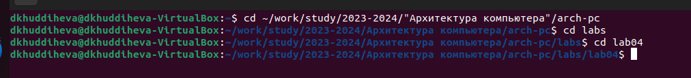{#fig:001 width=70%}

Создаю в текущем каталоге пустой текстовый файл hello.asm с помощью утилиты touch (рис. [-@fig:002]).

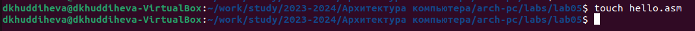{#fig:002 width=70%}

Открываю созданный файл в текстовом редакторе gedit.Заполняю файл,вставляя в него программу для вывода "Hello world!" (рис. [-@fig:003]).

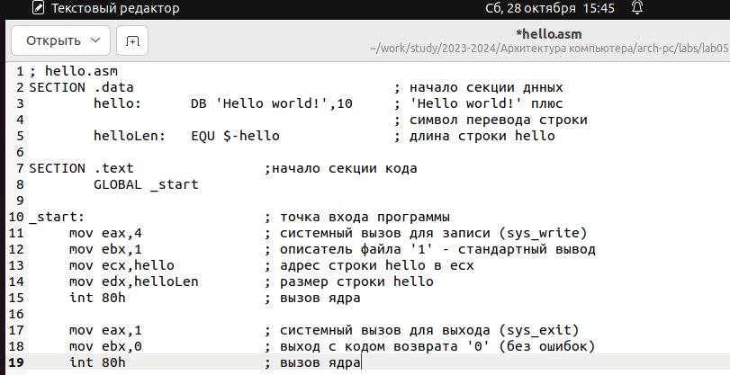{#fig:003 width=70%}

## Работа с транслятором NASM

Превращаю текст программы для вывода "Hello world!" в объектный код с помощью транслятора NASM, используя команду -f elf hello.asm
ключ -f указывает транслятору nasm,что требуется создать бинарный файл в формате ELF.Далее проверяю выполнение команды с помощью 
ls (рис. [-@fig:004]).

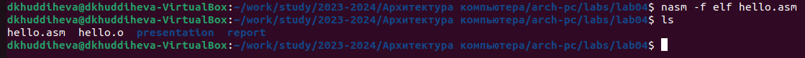{#fig:004 width=70%}

## Работа с расширенным синтаксисом командной строки NASM

Ввожу команду,которая скомпилирует  файл hello.asm в файл obj.o,при этом в файл будут включены символы для отладки (ключ-g),
также с помощью ключа -l будет создан файл листинга list.lst (рис. [-@fig:005]).

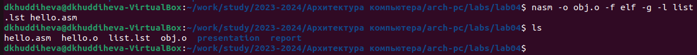{#fig:005 width=70%}

## Работа с компоновщиком LD

Передаю объектный файл hello.o на обработку компоновщику LD,чтобы получить исполняемый файл hello (рис. [-@fig:006]).

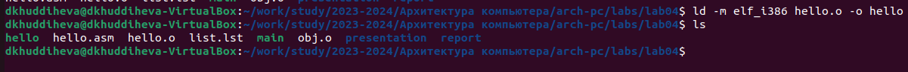{#fig:006 width=70%}

Выполняю следующую команду (рис. [-@fig:007]). Исполняемый файл будет иметь имя main,после ключа -o было задано значение main.
Объектный файл,из которого собран этот исполняемый файл имеет имя obj.o

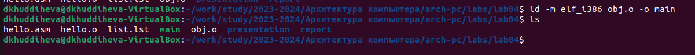{#fig:007 width=70%}

## Запуск исполняемого файла

Запускаю на выполнение созданный исполняемый файл hello (рис. [-@fig:008]).

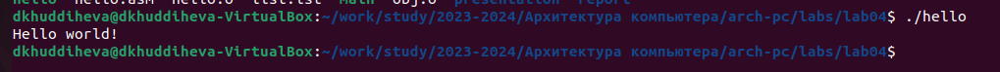{#fig:008 width=70%}

## Выполнение заданий для самостоятельной работы

С помощью утилиты cp создаю в текущем каталоге копию файла hello.asm с именем  lab4.asm (рис. [-@fig:009]).

{#fig:009 width=70%}

С помощью текстового редактора gedit открываю файл lab4.asm и вношу изменения в программу так,чтобы она выводила моё имя и фамилию
(рис. [-@fig:010]).

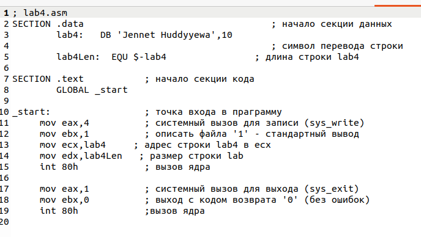{#fig:010 width=70%}

Компилирую текст программы в объектный файл (рис. [-@fig:011]).Проверяю с помощью утилиты ls?что файл lab5.asm создан.

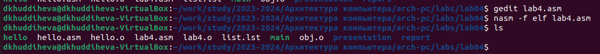{#fig:011 width=70%}

Передаю объектный файл lab4.o на обработку компоновщику LD,чтобы получить исполняемый файл lab4 (рис. [-@fig:012]).

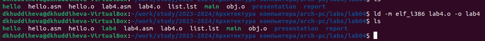{#fig:012 width=70%}

Запускаю исполняемый файл lab4,на экран действительно выводятся моё имя и фамилия (рис. [-@fig:013]).

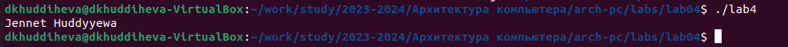{#fig:013 width=70%}

С помощью команд git add .и git commit добавляю файлы на GitHub (рис. [-@fig:014]).

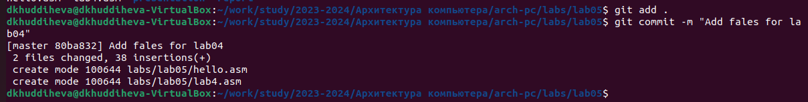{#fig:014 width=70%}.Отправляю файлы на сервер с помощью команды git push.

# Выводы

При выполнении данной лабораторной работы я освоила процедуры компиляции и сборки программ,написанных на ассемблера NASM.

