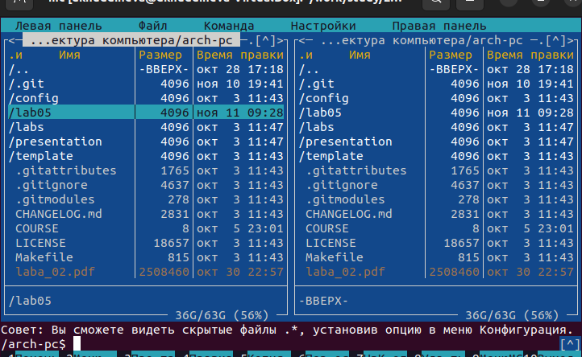
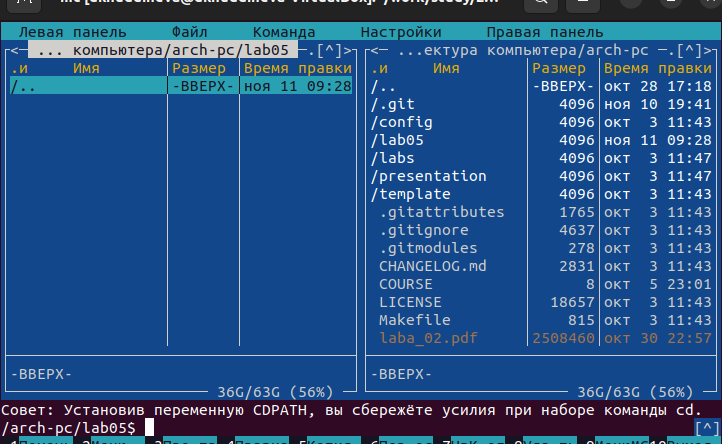
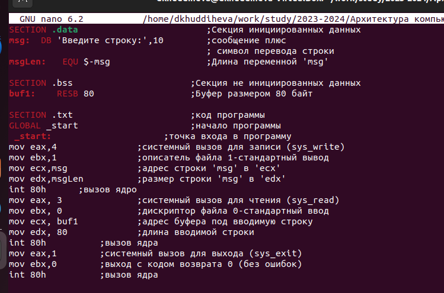
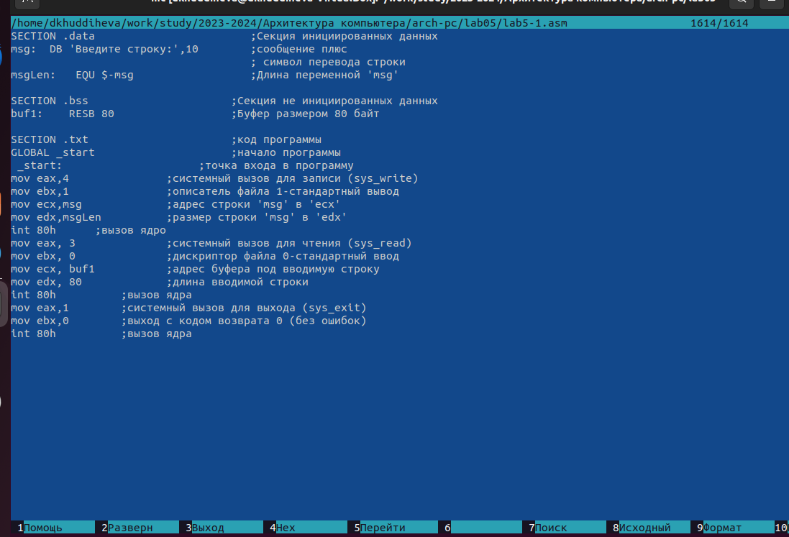
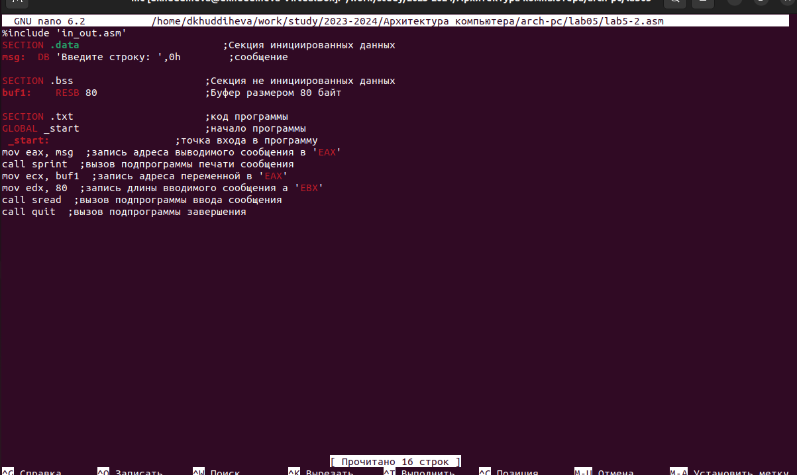
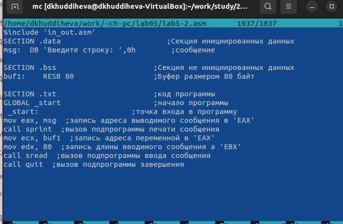
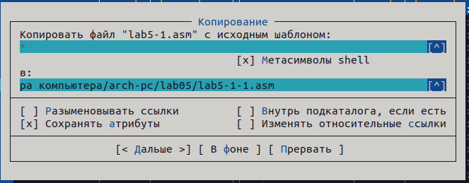
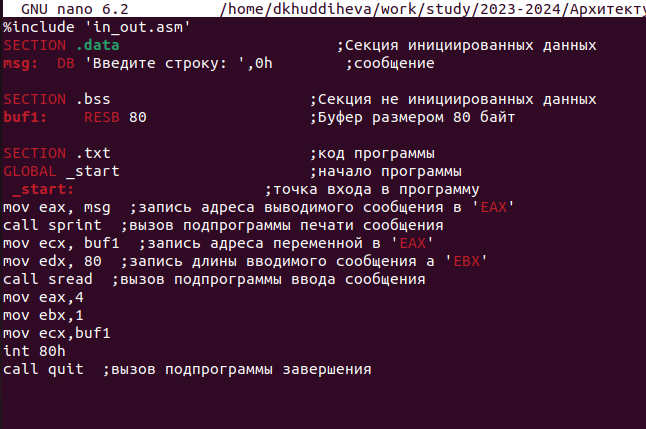

---
## Front matter
title: "Отчёт по лабораторной работе №5"
subtitle: "Дисциплина: архитектура компьютера"
author: "Худдыева Дженнет"

## Generic otions
lang: ru-RU
toc-title: "Содержание"

## Bibliography
bibliography: bib/cite.bib
csl: pandoc/csl/gost-r-7-0-5-2008-numeric.csl

## Pdf output format
toc: true # Table of contents
toc-depth: 2
lof: true # List of figures
lot: true # List of tables
fontsize: 12pt
linestretch: 1.5
papersize: a4
documentclass: scrreprt
## I18n polyglossia
polyglossia-lang:
  name: russian
  options:
	- spelling=modern
	- babelshorthands=true
polyglossia-otherlangs:
  name: english
## I18n babel
babel-lang: russian
babel-otherlangs: english
## Fonts
mainfont: PT Serif
romanfont: PT Serif
sansfont: PT Sans
monofont: PT Mono
mainfontoptions: Ligatures=TeX
romanfontoptions: Ligatures=TeX
sansfontoptions: Ligatures=TeX,Scale=MatchLowercase
monofontoptions: Scale=MatchLowercase,Scale=0.9
## Biblatex
biblatex: true
biblio-style: "gost-numeric"
biblatexoptions:
  - parentracker=true
  - backend=biber
  - hyperref=auto
  - language=auto
  - autolang=other*
  - citestyle=gost-numeric
## Pandoc-crossref LaTeX customization
figureTitle: "Рис."
tableTitle: "Таблица"
listingTitle: "Листинг"
lofTitle: "Список иллюстраций"
lotTitle: "Список таблиц"
lolTitle: "Листинги"
## Misc options
indent: true
header-includes:
  - \usepackage{indentfirst}
  - \usepackage{float} # keep figures where there are in the text
  - \floatplacement{figure}{H} # keep figures where there are in the text
---

# Цель работы

Целью данной лабораторной  работы является приобретение практических навыков работы в Midnight Commander,освоение инструкций 
языка ассемблера mov и int

# Задание

   1.Основы работы с mc
   2.Структура программы на языке ассемблера Nasm
   3.Подключение внешнего файла
   4.Выполнение заданий для самостоятельной работы

# Теоретическое введение

Midnigt Commander( или просто mc)- это программа,которая позволяет просмотривать структуру каталогов и выполнять основные операции
по управлению файловой системой,т.е. mc является файловом менеджером.Midnight Commander позволяет сделать  работу с файлами более 
удобной и наглядной.Программа на языке ассемблера Nasm,как правило,состоит из трёх секций:секция кода программы (SECTION .txt)
секция инициированных (известных во время компиляции) данных (SECTION .data) и секция не инициализированных данных (тех, под 
которые во время компиляции только отводится память,а значение присваивается в ходе выполнения программы) (SECTION .bss).
Для объявления инициированных данных в секции .data используются директивы DB,DD,DQ,DT,которые резервируют память и указывают,
какие значение должны хранится в этой памяти:
-DB (define byte)-определяет переменную размером в 1 байт
-DW (define word)-определяет переменную размером в 2 байта (слово)
-DD (define double word)-определяет переменную размером в 4 байта (двойное слово) 
-DQ (define quad word)-определяет переменную размером в 8 байта(учетверённое слово) 
-DT (define ten bytes)-определяет переменную размером в 10 байта.Директивы используются для объявления простых переменных и для 
объявления массивов.Для определения строк принято использовать директиву DB в связи с особенностями хранения данных в оперативной 
памяти.Инструкция языка ассемблера mov предназначена для дублирования данных источника в приёмнике.
```NASM
mov dst,src
```
Здесь операнд dst-приёмник, а src-источник.
В качестве операнда могут выступать регистры(register),ячейки памяти (memory) и непосредственные значения(const).
Инструкция языка ассемблера int предназначена для вызова прерывания с указанным номером.
```NASM
int n
```
Здесь n-номер прерывания,пренадлежащий диапазону 0-255.При программировании в Linux с использованием ядра sys_calls n=80h (принято
задавать в шестнадцатеричной системе счисления)

# Выполнение лабораторной работы

Открываю Midnight Commander, введя в терминал mc(рис. [@fig:001]).

{#fig:001 width=70%}

Перехожу в каталог ~/work/study/2023-2024/Архитектура компьютера/arch-pc,используя файловой менеджер mc (рис. [@fig:002]).

{#fig:002 width=70%}

С помощью функциональной клавиши F7 создаю каталог lab05 (рис. [@fig:003]).

{#fig:003 width=70%}

Перехожу в созданный каталог (рис. [@fig:004]).

{#fig:004 width=70%}

В строке ввода прописываю команду touch lab5-1.asm,чтобы создать файл,в котором буду работать 

## Структура программы на языке ассемблера NASM

С помощью функциональной клавиши F4 открываю созданный файл для редактирования в редакторе nano 
Ввожу в файл код программы для запроса строки у пользователя.Далее выхожу из файла(Ctrl+X),сохраняя изменения (Y,Enter)
(рис. [@fig:005]).

{#fig:005 width=70%}

С помощью функциональной клавиши F3открываю файл для просмотра,чтобы проверить,содержить ли файл текст программы 
(рис. [@fig:006]).

{#fig:008 width=70%}

Транслирую текст программы файла в объектный файл командой nasm -f elf lab5-1.asm.Создался объектный файл lab5-1.o.Выполняю 
компоновку объектного файла с помощью команды ld -m elf_i386 -o lab5-1 lab5-1.o.Создался исполняемый файл lab5-1 Запускаю
исполняемый файл.Программа выводит строку "ВВедите строку:" и ждёт ввода с клавиатуры,я ввожу свои ФИО,на этом 
программа заканчивает свою работу (рис. [@fig:007]).

{#fig:007width=70%}

## Подключение внешнего файла 

Скачиваю файл in_out.asm со страницы в ТУИС.Он сохранился в каталоге "Загрузки" С помощью функциональной клавиши F5 копирую файл
in_out.asm из каталоге Загрузки в созданный каталог lab05 (рис. [@fig:008]).

{#fig:008 width=70%}

С помощью функциональной клавиши F5 копирую файл lab5-1 в тот же каталог,но с другим именем,для этого в появившимся окне mc
прописываю имя для копии файла (рис. [@fig:009]).

{#fig:009 width=70%}

Изменяю содержимого файла lab5-2.asm во встроенном редакторе nano (рис. [@fig:010]).

{#fig:010 width=70%}

Транслирую текст программы файла в объектный файл командой nasm -f elf lab5-2.asm.Создался объектный файл lab5-2.o.Выполняю 
компоновку объектного файла с помощью команды ld -m elf_i386 -o lab5-2 lab5-2.o.Создался исполняемый файл lab5-2(рис. [@fig:011]).

{#fig:011 width=70%}

Открывю файл lab5-2.asm для редактирование в nano функциональной клавиши F4. Изменяю в нём  подпрограмму sprintLF на sprint.
сохраняю файл для просмотра,чтобы проверить сохранение действий (рис. [@fig:012]).

{#fig:012 width=70%}

Снова транслирую файл,выполняю компоновку созданного объектного файла,запускаю новый исполняемый файл(рис. [@fig:013]).

{#fig:013 width=70%}

## Выполнение заданий для самостоятельной работы

  1.Создаю копию файла lab5-1.asm с именем lab5-1-1.asm с помощью функциональной клавиши F5 (рис. [@fig:014]).
  
{#fig:014 width=70%}

С помощью функциональной клавиши F4 открываю созданный файл для редактирования.Изменяю программу так,чтобы кроме вывода приглаше-
ния и запроса ввода,она выводила вводимую пользователем строку (рис. [@fig:015]).

{#fig:015 width=70%}

  2.Создаю объектный файл lab5-1-1.о,отдаю его на обработку компоновщику,получаю исполняемый файл.Программа запрашивает ввод,
ввожу свои ФИО,далее прорамма выводит введенные мною данные (рис. [@fig:016]).
  
{#fig:016 width=70%}

Код программы из пункта 1:

```NASM
SECTION .data   ;Секция инициированных данных

msg:  DB 'Введите строку:',10

msglen: EQU $-msg  ;Длина переменной 'msg'
SECTION .bss  ;Секция не инициированных данных
buf1: RESB 80  ;Буфер размером 80 байт
SECTION .text ;Код программы
GLOBAL _start  ;начало программы 
 _start:  ;Точка входа  в программу
mov eax,4
mov ebx,1
mov ecx,msg
mov edx,msgLen
int 80h
mov eax, 3
mov ebx, 0
mov ecx, buf1
mov edx, 80
int 80h
mov eax,4
mov ebx,1
mov ecx,buf1
mov edx,buf1
int 80h
mov eax,1
mov ebx,0
int 80h
```

  3.Создаю копии файла lab5-2.asm с именем lab5-2-1.asm с помощью функциональной клавиши F5 (рис. [@fig:017]).
  
{#fig:017 width=70%}

С помощью функциональной клавиши F4 открываю созданный файл для редактирования.Изменяю программу так чтобы кроме вывода 
приглашения и запроса ввода,она выводила вводимую пользователем строку (рис. [@fig:018]).

{#fig:018 width=70%}

  4.Создаю объектный файл lab5-2-1.о, отдаю его на обработку компоновщику,получаю исполняемый файл lab5-2-1,запускаю полученный 
исполняемый файл.Программа запрашивает ввод без переноса на новую строку,ввожу свои ФИО,далее программа выводит введенные 
мною данные (рис. [@fig:019]).

{#fig:019 width=70%}


# Выводы

При выполнении данной лабораторной работы я приобрела практические навыки работы в Midnight Commander,а так же освоила инструкции 
языка ассемблера mov и int

# Список литературы{.unnumbered}

Лабораторная работа №6

::: {#refs}
:::
