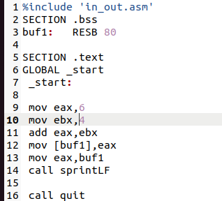
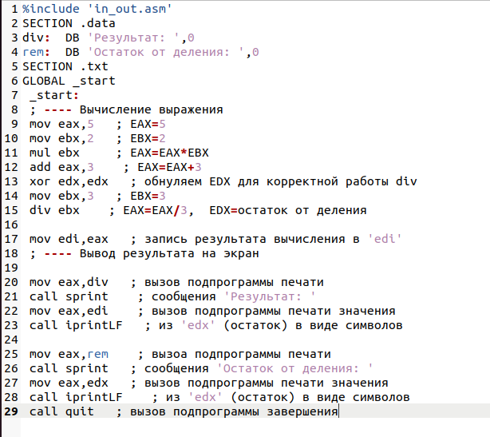

---
## Front matter
title: "Отчёт по лабораторной работе №6"
subtitle: "Дисциплина: архитектура компьютера"
author: "Худдыева Дженнет"

## Generic otions
lang: ru-RU
toc-title: "Содержание"

## Bibliography
bibliography: bib/cite.bib
csl: pandoc/csl/gost-r-7-0-5-2008-numeric.csl

## Pdf output format
toc: true # Table of contents
toc-depth: 2
lof: true # List of figures
lot: true # List of tables
fontsize: 12pt
linestretch: 1.5
papersize: a4
documentclass: scrreprt
## I18n polyglossia
polyglossia-lang:
  name: russian
  options:
	- spelling=modern
	- babelshorthands=true
polyglossia-otherlangs:
  name: english
## I18n babel
babel-lang: russian
babel-otherlangs: english
## Fonts
mainfont: PT Serif
romanfont: PT Serif
sansfont: PT Sans
monofont: PT Mono
mainfontoptions: Ligatures=TeX
romanfontoptions: Ligatures=TeX
sansfontoptions: Ligatures=TeX,Scale=MatchLowercase
monofontoptions: Scale=MatchLowercase,Scale=0.9
## Biblatex
biblatex: true
biblio-style: "gost-numeric"
biblatexoptions:
  - parentracker=true
  - backend=biber
  - hyperref=auto
  - language=auto
  - autolang=other*
  - citestyle=gost-numeric
## Pandoc-crossref LaTeX customization
figureTitle: "Рис."
tableTitle: "Таблица"
listingTitle: "Листинг"
lofTitle: "Список иллюстраций"
lotTitle: "Список таблиц"
lolTitle: "Листинги"
## Misc options
indent: true
header-includes:
  - \usepackage{indentfirst}
  - \usepackage{float} # keep figures where there are in the text
  - \floatplacement{figure}{H} # keep figures where there are in the text
---

# Цель работы

Цель данной лабораторной раюоты - освоение арефметических инструкций языка ассемблера NASM. 

# Задание

   1.Символьные и численные данные в NASM.
   2.Выполнение арифметических операций в NASM.
   3.Выполнение заданий для самостоятельной работы.

# Теоретическое введение

   Большинство инструкций на языке ассемблера требуют обработки операндов.Адрес операнда предоставляет место,где хранятся данные,
подлежащие обработке.Это могут быть данные хранящиеся в регистре или в ячейке памяти.
- Регистровая адресация - операнды хранятся в регистрах и в команде используются имена этих регистров,например: mov ax,bx.
- Непосредственная адресация - значение операнда задаётся непосредственно в команде,например: mov ax,2.
- Адресация памяти - операнд задаёт адрес в памяти.В команде указывается символическое обозначение ячейки памяти, над содержимым
которой требуется выполнить операцию.

   Ввод информации с клавиатуры и вывод её на экран осуществляется в символьном виде.Кодирование этой информации производится сог-
ласно кодовой таблице символов ASCII.ASCII - сокращение от American Standard Code for Information Interchange(Американский 
стандартный код для обмена информацией).Согласно стандарту ASCII каждый символ кодируется одним байтом.Среди инструкций NASM
нет такой,которая выводит числа(не в символьном виде).Поэтому,например,чтобы вывести число,надо предворительно преобразовать
его цифры в ASCII-коды этих цифр и выводит на экран эти коды,а не само число.Если же выводить число на экран непосредственно, 
то экран воспримет его не как число,а как последовательность ASCII-символов-каждый байт число будет воспринят как один ASCII-
-символ и выведет на экран эти символы.

# Выполнение лабораторной работы

## Символьные и численные данные в NASM

С помощью утилиты mkdir создаю директорию,в которой буду создавать файлы с программами для лабораторной работы №6 (рис.[@fig:001])
С помощью утилиты touch создаю файл lab6-1.asm

{#fig:001 width=70%}

Копирую в текущий каталог файл in_out.asm с помощью утилиты cp (рис.[@fig:002]).

{#fig:002 width=70%}

Открываю созданный файл lab6-1.asm,вставляю в него программу вывода значения регистра eax (рис.[@fig:003]).

{#fig:003 width=70%}

Создаю исполняемый файл программы и запускаю его (рис.[@fig:004]).Вывод программы: символ j потому что программа вывела символ,
соответствующий по системе ASCII сумме двоичных кодов символов 4 и 6.

{#fig:004 width=70%}

Изменяю в тексте программы "6" и "4" на цифру 6 и 4 (рис.[@fig:005]).

{#fig:005 width=70%}

Создаю новый исполняемый файл программы и запускаю его (рис.[@fig:006]).Теперь вывелся символ 10,это символ перевода строки,этот
символ не отображается при выводе на экран.

{#fig:006 width=70%}

Создаю новый файл lab6-2.asm с помощью утилиты touch (рис.[@fig:007]).

{#fig:007 width=70%}

Ввожу в файл текст другой программы для вывода значения регистра eax (рис.[@fig:008]).

{#fig:008 width=70%}

Создаю и запускаю исполняемый файл lab6-2 (рис.[@fig:009]).Теперь вывод числа 106,потому что программа позволяет вывести именно
число,а не символ,хотя всё ещё происходит именно сложение кодов символов "6" и "4".

{#fig:009 width=70%}

Заменяю в тексте программы в файле lab6-2.asm символы "6" и "4" на число 6 и 4 (рис.[@fig:010]).

{#fig:010 width=70%}

Создаю и запускаю новый исполняемый файл (рис.[@fig:011]).Теперь программа складывает не соответствующие символом коды в системе
ASCII,а сами числа,поэтому вывод 10.

{#fig:011 width=70%}

Заменяю в тексте программы функцию iprintLF на iprint (рис.[@fig:012]).

{#fig:012 width=70%}

Создаю и запускаю новый исполняемый файл (рис.[@fig:013]).Вывод не изменился,потому что символ переноса строки не отображался,
когда программа исполнялась с функцией iprintLF,а iprint не добавляет к выводу символ переноса строки, в отличие от iprintLF.

{#fig:013 width=70%}

## Выполнение арифметических операций в NASM

Создаю файл lab6-3.asm с помощью утилиты touch (рис.[@fig:014]).

{#fig:014 width=70%}

Ввожу в созданный файл текст программы для вычисления значения выражения f(x)=(5*2+3)/3 (рис.[@fig:015]).

{#fig:015 width=70%}

Создаю исполняемый файл и запускаю его (рис.[@fig:016]).

{#fig:016 width=70%}

Изменяю программу так,чтобы она вычисляла значение выражения (рис.[@fig:017]).

{#fig:017 width=70%}

Создаю и запускаю новый исполняемый файл (рис.[@fig:018]).

{#fig:018 width=70%}

Создаю файл variant.asm с помощью утилиты touch (рис.[@fig:019]).

{#fig:019 width=70%}

Ввожу в файл текст программы для вычисления варианта задания по номеру студенческого билета (рис.[@fig:020]).

{#fig:020 width=70%}

Создаю и запускаю исполняемый файл (рис.[@fig:021]).Ввожу номер своего студ.билета с клавиатуры,программа вывела что мой 
вариант-17

{#fig:021 width=70%}

### Ответы на вопросы по программе

 1.За вывод сообщения "Ваш вариант" отвечают строки кода:
   
```NASM
   mov eax,rem
   call sprint
```
2.Инструкция mov ecx, x используется,чтобы положит адрес вводимой строки x в регистр ecx
mov edx, 80 - запись в регистр еdx длины вводимой строки
call sread - вызов программы из внешнего файла,обеспечивающей ввод сообщения с клавиатуры

3.call atoi используется для вызова подпрограммы из внешнего файла,которая преобразует ASCII -код символа в целое и записывает 
результат в регистр eax

4.За вычисления варианта отвечают строки:

```NASM
xor edx,edx  ; обнуление edx для корректной работы div
mov ebx,20  ; ebx=20
div ebx  ; eax=eax/20, edx-остаток от деления
inc edx  ; edx=edx+1
```
5.При выполнении инструкции div ebx остаток от деления записывается в регистр edx

6.Инструкция inc edx увеличивает регистра edx на 1

7.За вывод на экран результатов вычислений отвечают строки:

```NASM
mov eax,edx
call iprintLF
```

## Выполнение заданий для самостоятельной работы

Создаю файл lab6-4.asm с помощью утилиты touch (рис.[@fig:022])

{#fig:022 width=70%}

Открываю созданной файл для редактирования,ввожу в него текст программы для вычисления значения выражения 18*(х+1)/6.Это выражение 
было под вариантом 17 (рис.[@fig:023])

{#fig:023 width=70%}

Создаю и запускаю исполняемый файл (рис.[@fig:024])

{#fig:024 width=70%}

**Листинг 4.1. Программа для вычисления значения выражения 18*(х+1)/6.**

# Выводы

При выполнении данной лабораторной работы я освоила арифметические инструкции языка ассемблера NASM

