---
## Front matter
title: "Отчёта по лабораторной работе №7"
subtitle: "Дисциплина: архитектура компьютера"
author: "Худдыева Дженнет"

## Generic otions
lang: ru-RU
toc-title: "Содержание"

## Bibliography
bibliography: bib/cite.bib
csl: pandoc/csl/gost-r-7-0-5-2008-numeric.csl

## Pdf output format
toc: true # Table of contents
toc-depth: 2
lof: true # List of figures
lot: true # List of tables
fontsize: 12pt
linestretch: 1.5
papersize: a4
documentclass: scrreprt
## I18n polyglossia
polyglossia-lang:
  name: russian
  options:
	- spelling=modern
	- babelshorthands=true
polyglossia-otherlangs:
  name: english
## I18n babel
babel-lang: russian
babel-otherlangs: english
## Fonts
mainfont: PT Serif
romanfont: PT Serif
sansfont: PT Sans
monofont: PT Mono
mainfontoptions: Ligatures=TeX
romanfontoptions: Ligatures=TeX
sansfontoptions: Ligatures=TeX,Scale=MatchLowercase
monofontoptions: Scale=MatchLowercase,Scale=0.9
## Biblatex
biblatex: true
biblio-style: "gost-numeric"
biblatexoptions:
  - parentracker=true
  - backend=biber
  - hyperref=auto
  - language=auto
  - autolang=other*
  - citestyle=gost-numeric
## Pandoc-crossref LaTeX customization
figureTitle: "Рис."
tableTitle: "Таблица"
listingTitle: "Листинг"
lofTitle: "Список иллюстраций"
lotTitle: "Список таблиц"
lolTitle: "Листинги"
## Misc options
indent: true
header-includes:
  - \usepackage{indentfirst}
  - \usepackage{float} # keep figures where there are in the text
  - \floatplacement{figure}{H} # keep figures where there are in the text
---

# Цель работы

Изучение команд условного и безусловного переходов.Приобретение навыков написания программ с использованием переходов.Знакомство
с назначением и структурой файла листинга.

# Задание

  1.Реализация переходов в NASM.
  
  2.Изучение структуры файлы листинга.
  
  3.Задания для самостоятельной работы.

# Теоретическое введение

Для реализации ветвлений в ассемблере используются так называемые команды передачи управления или команды переходов.Можно выделить
2 типа переходов:

- условный переход-выполнение или не выполнение переходав определённую точку программы в зависимости от проверки условия.

- безусловный переход-выполнение передачи управления в определённую точку программы без каких-либо условий.

Безусловный переход выполняется инструкцией jmp.Инструкция cmp является одной из инструкций,которая позволяет сравнить операнды и
выставляет флаги в зависимости от результата сравнения.Инструкция cmp является командой сравнения двух операндов и имеет такой же
формат, как и команды вычитания.

Листинг (в аппарате NASM) - это один из выходных файлов, так как кроме строк самой программы он содержит дополнительную информайию

# Выполнение лабораторной работы

## Реализация переходов в NASM

Создаю каталог для программы лабораторной работы №7,перехожу в него и создаю файл lab7-1.asm (рис. [@fig:001]).

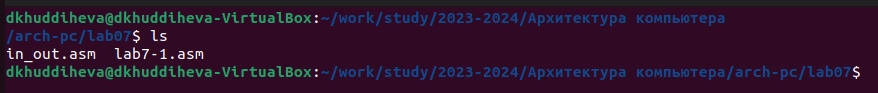{#fig:001 width=70%}

Ввожу файл lab7-1.asm текст программы из листинга 7.1. (рис. [@fig:002]).

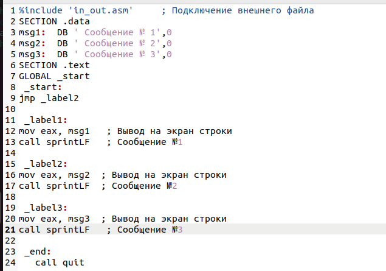{#fig:002 width=70%}

Создаю исполняемый файл и запускаю его (рис. [@fig:003]).

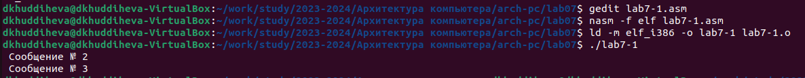{#fig:003 width=70%}

Таким образом,использование инструкции jmp _label2 меняет порядок исполнения инструкций и позволяет выполнить инструкции начиная с
метки _label2, пропустив вывод первого сообщения.

Изменяю программу таким образом,чтобы она выводила сначала 'Сообщение №2', потом 'Сообщение №1' и завершала работу.Для этого 
изменяю текст программы в соответствии с листингом 7.2 (рис. [@fig:004]).

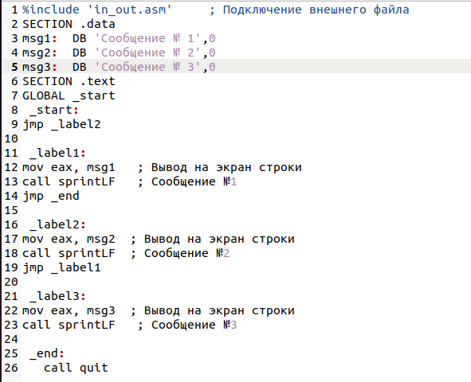{#fig:004 width=70%}

Создаю исполняемый файл и проверяю его.(рис. [@fig:005]).

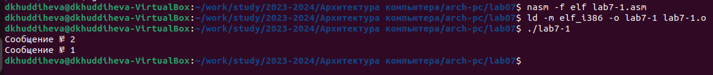{#fig:005 width=70%}

Изменяю текст программы, добавив в начале программы jmp _label3, jmp _label2 в конце метки jmp _label3, jmp _label1 добавляю 
в конце метки jmp _label2, и добавляю jmp _end в конце метки jmp _label1 (рис. [@fig:006]).

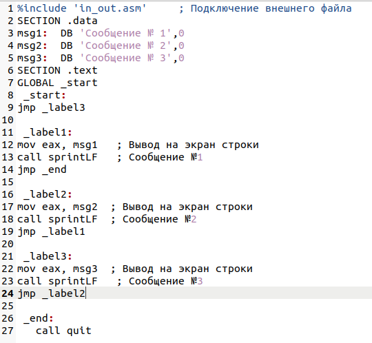{#fig:006 width=70%}

Вывод программы будет таким образом:(рис. [@fig:007]).

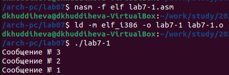{#fig:007 width=70%}

Рассмотрим программу,которая определяет и выводит на экран наибольшую из 3 целочисленных переменных: A,B,C.Значение для А и С
задаются в программе, значение В вводиться с клавиатуры.Создаю файл lab7-2.asm (рис. [@fig:008]).

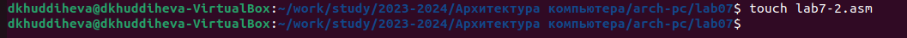{#fig:008 width=70%}

Текст программы из листинга 7.3 ввожу в lab7-2.asm (рис. [@fig:009]).

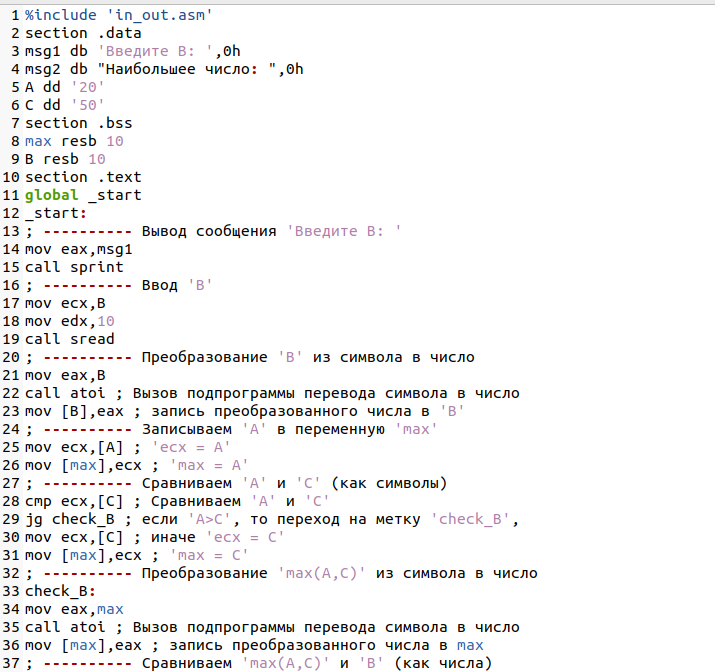{#fig:009 width=70%} 

Создаю исполняемый файл и проверяю его (рис. [@fig:010]).

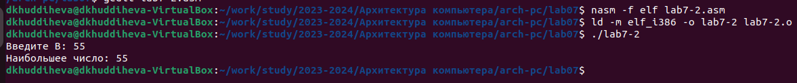{#fig:010 width=70%} 

## **Изучение структуры файлы листинга**

Создаю файл листинга для программы из файла lab7-2.asm (рис. [@fig:011]).

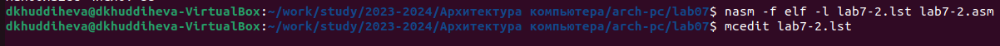{#fig:001 width=70%} 

Открываю файл листинга lab7-2.lst с помощью текстового редактора и внимательно изучаю его формат и содержимое.((рис. [@fig:012]).

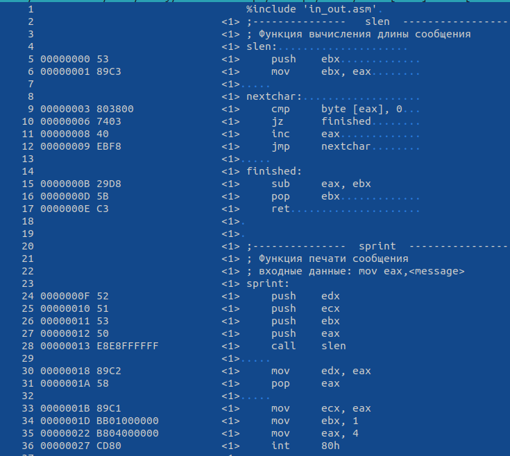{#fig:012 width=70%} 

В представленных трёх строчках содержаться следующие данные: (рис. [@fig:013]).

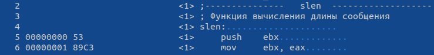{#fig:013 width=70%} 

"3"-номер строки кода, ;Функция вычисления длинны сообщения  - комментарий к коду,не имеет адреса и машинного кода.

"4"-номер строки кода,"slen"- название функции, не имеет адреса и машинного кода. 

"5"-номер строки кода, "00000000" -адрес строки,"53" - машинный код, "push ebx"- исходный текст программы, инструкция "push" 
помещает операнд "ebx" в стек.

Открываю файл с программой lab7-2.asm и выбранной мной инструкции с двумя операндами удаляю выделенный операнд.(рис. [@fig:014]).

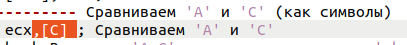{#fig:014 width=70%} 

Выполняю трансляцию с получением файла с листинга (рис. [@fig:015]).

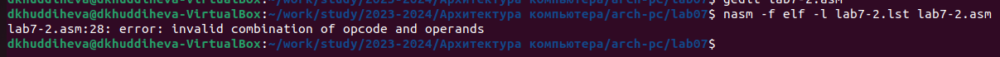{#fig:015 width=70%} 

## **Задания для самостоятельной работы**

1.Пишу программу нахождения наименьшей из 3 целочисленных переменных а,b,c.Значения переменных выбираю из табл. 7.5 в соотвестсвии с
вариантом, полученным при выполнении лабораторной работы №7.Мой вариант под номером 17. (рис. [@fig:016]).

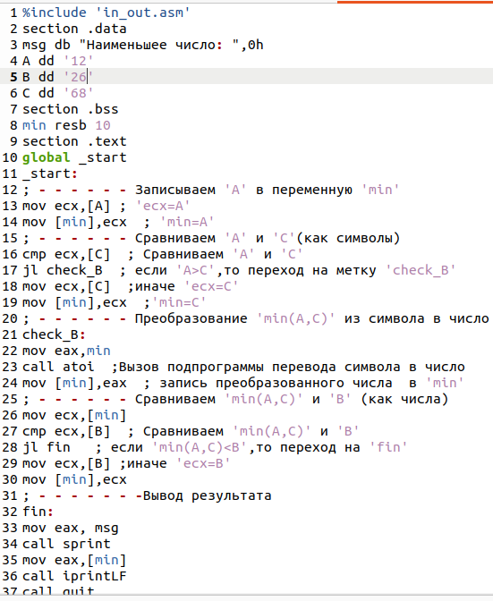{#fig:016 width=70%} 

Создаю исполняемый файл и проверяю его работу (рис. [@fig:017]).

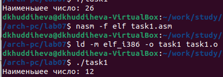{#fig:016 width=70%} 

# Выводы

Я изучила команды условного и безусловного переходов и приобрела навыки написания
программ с использованием переходов, а также познакомилась с назначением и структурой файла
листинга.

# Список литературы{.unnumbered}

[Лабораторная работа №7](https://esystem.rudn.ru/pluginfile.php/2089087/mod_resource/content/0/%D0%9B%D0%B0%D0%B1%D0%BE%D1%80%D0%B0%D1%82%D0%BE%D1%80%D0%BD%D0%B0%D1%8F%20%D1%80%D0%B0%D0%B1%D0%BE%D1%82%D0%B0%20%E2%84%967.%20%D0%9A%D0%BE%D0%BC%D0%B0%D0%BD%D0%B4%D1%8B%20%D0%B1%D0%B5%D0%B7%D1%83%D1%81%D0%BB%D0%BE%D0%B2%D0%BD%D0%BE%D0%B3%D0%BE%20%D0%B8%20%D1%83%D1%81%D0%BB%D0%BE%D0%B2%D0%BD%D0%BE%D0%B3%D0%BE%20%D0%BF%D0%B5%D1%80%D0%B5%D1%85%D0%BE%D0%B4%D0%BE%D0%B2%20%D0%B2%20Nasm.%20%D0%9F%D1%80%D0%BE%D0%B3%D1%80%D0%B0%D0%BC%D0%BC%D0%B8%D1%80%D0%BE%D0%B2%D0%B0%D0%BD%D0%B8%D0%B5%20%D0%B2%D0%B5%D1%82%D0%B2%D0%BB%D0%B5%D0%BD%D0%B8%D0%B9..pdf)
