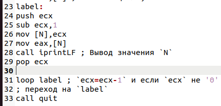
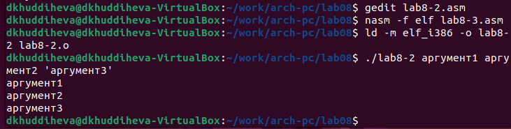

---
## Front matter
title: "Отчёт лабораторной работы №8"
subtitle: "Дисциплина: архитектура коипьютера"
author: "Худдыева Дженнет"

## Generic otions
lang: ru-RU
toc-title: "Содержание"

## Bibliography
bibliography: bib/cite.bib
csl: pandoc/csl/gost-r-7-0-5-2008-numeric.csl

## Pdf output format
toc: true # Table of contents
toc-depth: 2
lof: true # List of figures
lot: true # List of tables
fontsize: 12pt
linestretch: 1.5
papersize: a4
documentclass: scrreprt
## I18n polyglossia
polyglossia-lang:
  name: russian
  options:
	- spelling=modern
	- babelshorthands=true
polyglossia-otherlangs:
  name: english
## I18n babel
babel-lang: russian
babel-otherlangs: english
## Fonts
mainfont: PT Serif
romanfont: PT Serif
sansfont: PT Sans
monofont: PT Mono
mainfontoptions: Ligatures=TeX
romanfontoptions: Ligatures=TeX
sansfontoptions: Ligatures=TeX,Scale=MatchLowercase
monofontoptions: Scale=MatchLowercase,Scale=0.9
## Biblatex
biblatex: true
biblio-style: "gost-numeric"
biblatexoptions:
  - parentracker=true
  - backend=biber
  - hyperref=auto
  - language=auto
  - autolang=other*
  - citestyle=gost-numeric
## Pandoc-crossref LaTeX customization
figureTitle: "Рис."
tableTitle: "Таблица"
listingTitle: "Листинг"
lofTitle: "Список иллюстраций"
lotTitle: "Список таблиц"
lolTitle: "Листинги"
## Misc options
indent: true
header-includes:
  - \usepackage{indentfirst}
  - \usepackage{float} # keep figures where there are in the text
  - \floatplacement{figure}{H} # keep figures where there are in the text
---

# Цель работы

Приобретение навыков написания программ с использованием циклов и обработкой аргументов командной строки.

# Задание

  1.Реалтзация циклов в NASM.
  
  2.Обработка аргументов командной строки.
  
  3.Задание для самостоятельной работы.

# Теоретическое введение

Стек - это структура данных, организованная по принципу LIFO ("Last In-First Out" или "последний пришёл-первым ушёл").Стек является
частью архитектуры процессора и реализован на аппаратном уровне.Для работы со стеком в процессоре есть специальные 
регистры (ss,bp,sp) и команды.
Основной функцией стека является функция сохранения адресов возврата и передачи аргументов при вызове процедур.Кроме того,в нём 
выделяется память для локальных переменных и могут временно храниться значения регистров.Стек имеет вершину, адрес последнего 
добавленного элемента, который хранится в регистр esp (указатель стека).Противоположный конец стека называется дном.Значение,
помещённое в стек последним, извлекается первым.При помещении значения в стек указатель стека уменьшается, а при извлечении - 
увеличивается.

Команда push размещает значение в стеке, т.е. помещает значение в ячейку памяти, на которую указывает регистр esp, после этого 
значение регистра esp увеличивается на 4. Данная команда имеет один операнд - значение, которое необходимо поместить в стек.

команда pop извлекает значение из стека, т.е. извлекает значения из ячейки памяти, на которую указывает регистр esp, после этого 
уменьшает значение регистра esp на 4. у этой команды также один операнд, который может быть регистром или переменной в памяти.
Нужно помнить, что извлечённый из стека элемент не стирается из памяти и остаётся как "мусор", который будет перезаписан при 
записи нового значения в стек.

Для организации циклов существуют специальные инструкции.Для всех инструкций максимальное количество проходов задаётся в регистре 
ecx. Наиболее простой является инструкция loop. Она позволяет организовать безусловный цикл.

# Выполнение лабораторной работы

## Реализация циклов в NASM

Создают каталог для программ лабораторной работы №8, перехожу в него и создаю файл lab8-1.asm (рис. [@fig:001]).

{#fig:001 width=70%}

Ввожу в файл lab8-1.asm текст программы из листинга 8.1 (рис. [@fig:002]).

{#fig:002 width=70%}

Создаю исполняемый файл и проверяю его работу. (рис. [@fig:003]).

{#fig:003 width=70%}

Данная программа выводит числа от N до 1 включительно.

Изменяю текст программы,добавив изменение значения регистра ecx в цикле. (рис. [@fig:004]).

{#fig:004 width=70%}

Создаю исполняемый файл и проверяю его работу.(рис. [@fig:005]).

{#fig:005 width=70%}

В данном случае число проходов цикла не соответствует введенному с клавиатуры значению.

Вношу изменения в тексте программы, добавив команды push и pop для сохранения значения счетчика цикла loop. (рис. [@fig:006]).

{#fig:006 width=70%}

Создаю исполняемый файл и проверяю его работу. (рис. [@fig:007]).

{#fig:007 width=70%}

В данном случае число проходов цикла соответствует введенному с клавиатуры значению и выводит числа от N-1 и 0 включительно.

## **Обработка аргументов командной строки**

Создаю файл lab8-2.asm и ввожу в него текст программы из листинга 8.2. (рис. [@fig:008]).

{#fig:008 width=70%}

Создаю исполняемый файл и запускаю его,указав нужные аргументы. (рис. [@fig:009]).

{#fig:009 width=70%}

Рассмотрим пример программы,которая выводит сумму чисел, котрые передаются в программу как аргументы. Создаю файл lab8-3.asm и
ввожу в него текст программы из листинга 8.3. (рис. [@fig:010]).

{#fig:010 width=70%}

Создаю исполняемый файл и запускаю его, указав аргументы. (рис. [@fig:011]).

{#fig:011 width=70%}

Изменяю текст программы из листинга 8.3 для вычисления произведения аргументов командной строки. (рис. [@fig:012]).

{#fig:012 width=70%}

Создаю исполняемый файл и запускаю его, указав аргументы. (рис. [@fig:013]).

{#fig:013 width=70%}

## Задание для самостоятельной работы

Пишу текст программы,которая находит сумму значений функции f(x)=10(x-1) в соответствии с моим номером варианта (17) для 
x=x1,x2,...,xn.(рис. [@fig:014).

{#fig:014 width=70%}

Создаю исполняемый файл и проверяю его работу на нескольких наборах x=x1,x2,...,xn.(рис. [@fig:015]).

{#fig:015 width=70%}

# Выводы

Благодаря данной лабораторной работе я приобрела навыки написания программ использованием циклов командной строки,что поможет мне 
при выполнении последующих лабораторных работ.

